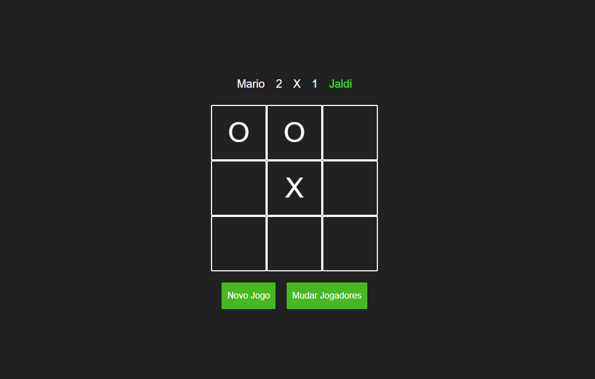

<h2>
    Jogo da Velha
</h2>

    O famoso jogo da velha.

    

<h2 id='objective'>Objetivo</h2>

    Esse jogo foi feito para praticar e demonstrar minhas habilidades com React, Redux e TypeScript.

<h2 id='technologies'>
    Tecnologias
</h2>
<ul>
    <li>
        <a href="reactjs.org/">React</a>
    </li>
    <li>
        <a href="styled-components.com">Styled Components</a>
    </li>
    <li>
        <a href="redux.js.org/">Redux</a>
    </li>
    <li>
        <a href="typescriptlang.org">TypeScript</a>
    </li>
</ul>

<h2>
    Link do projeto:
</h2>

    <a href="https://new-tic-tac-toe.vercel.app/">New Tic-Tac-Toe</a>

